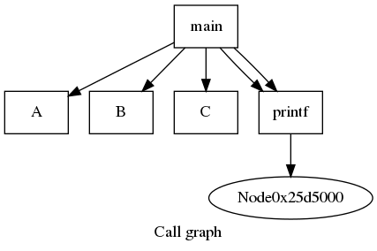
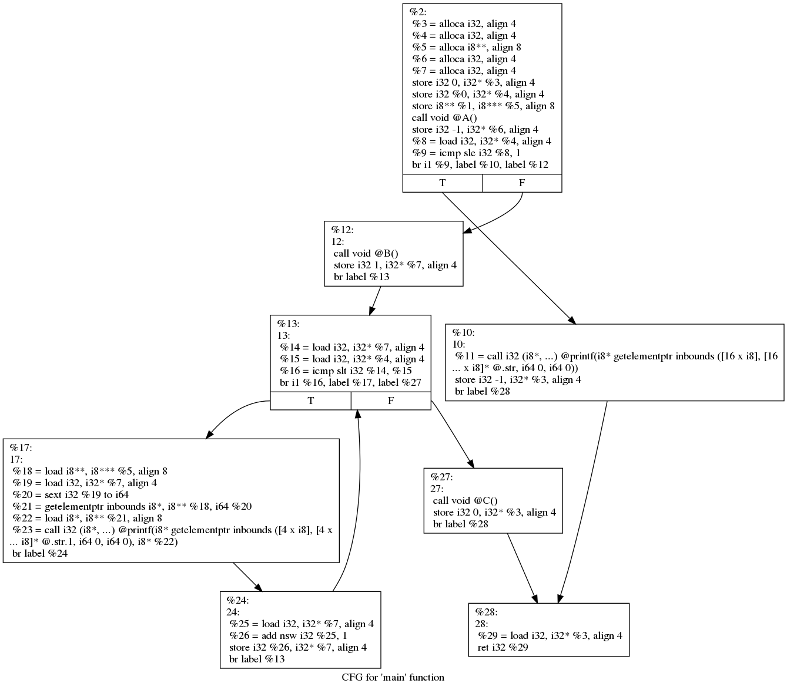
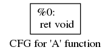
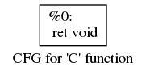

# Lab6 of NCTU SW Testing
a practice of generating call graph and control flow graph

## Usage
* Generate call graph
	```
	./call_graph.sh <C File> <target png file>
	```
* Generate control flow graph
	```
	./ctrl_flow.sh <C File>
	```
## Sample Output
* Callgraph

	

* Control Flow Graph for `main()`

	

* Control Flow Graph for `A()`

	

* Control Flow Graph for `B()`

	

* Control Flow Graph for `C()`

	
## Reference
* [call graph](https://stackoverflow.com/questions/5373714/how-to-generate-a-calling-graph-for-c-code)
* [control flow graph](https://stackoverflow.com/questions/40563240/control-flow-graph-generator-for-code-in-c)
